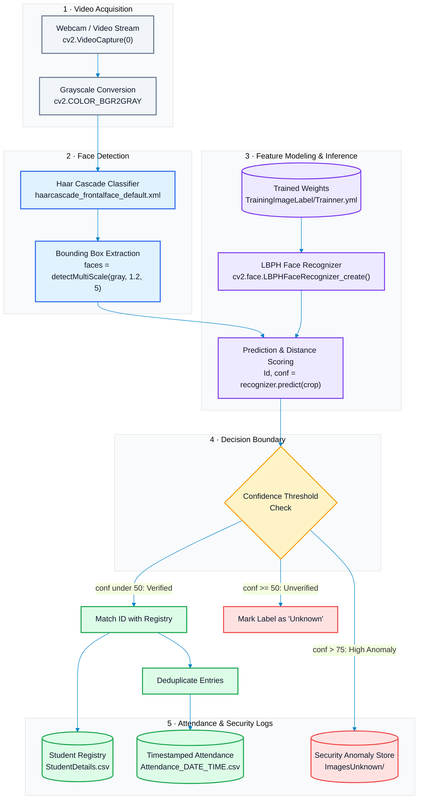
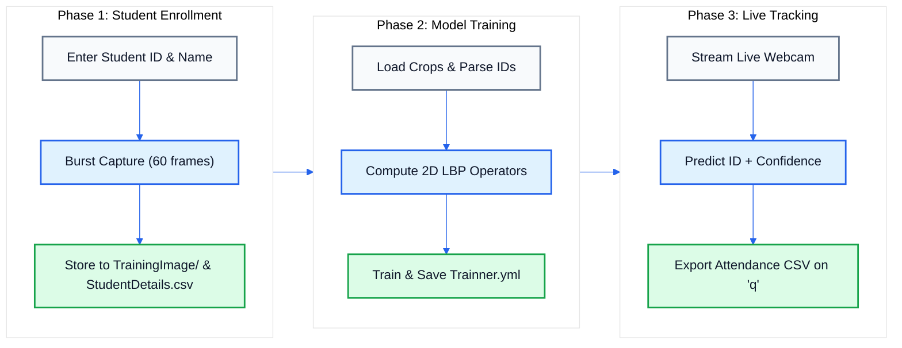

<p align="center">
  
</p>

<p align="center">
  <a href="https://www.python.org/downloads/"></a>
  <a href="https://opencv.org/"></a>
  <a href="https://numpy.org/"></a>
  <a href="https://pandas.pydata.org/"></a>
  <a href="https://docs.python.org/3/library/tkinter.html"></a>
  <a href="#license"></a>
</p>

---

## 📌 Executive Overview

**Facial Biometrics for Seamless Attendance Tracking** is an automated, non-intrusive computer vision system designed to eliminate the inefficiencies and proxy vulnerabilities of traditional attendance tracking in educational institutions and enterprise environments.

Manual paper roll calls and magnetic swipe cards suffer from high time latency, human recording errors, and buddy punching. This project automates the entire pipeline:
1. **Face Detection**: Rapid localization of human facial bounding boxes via Haar Feature-based Cascade Classifiers.
2. **Feature Extraction & Learning**: Texture analysis and histogram modeling using Local Binary Patterns Histograms (LBPH).
3. **Real-Time Recognition & Verification**: Low-latency video stream matching against registered student models with confidence-gated thresholds.
4. **Automated Auditing**: Deduplicated, timestamped CSV attendance reporting, alongside automatic capture of unrecognized individuals for campus security.

---

## ⚡ Key Engineering Features

- 📸 **Automated Sample Capture Pipeline**: Ingests 60 normalized facial crops per student via active webcam streaming, ensuring training variations across minor head tilts and expressions.
- 🎯 **Haar Cascade Feature Localization**: Multi-scale sliding window detection (`haarcascade_frontalface_default.xml`) optimized for real-time inference on standard CPU hardware.
- 🧠 **Illumination-Invariant LBPH Recognizer**: Employs $3 \times 3$ pixel neighborhood thresholding to create texture histograms resilient to ambient classroom lighting variations.
- 🛡️ **Confidence-Gated Validation**:
  - `Confidence < 50`: Verified positive match &rarr; logged to attendance roster.
  - `Confidence >= 50`: Unverified &rarr; labeled as `Unknown`.
  - `Confidence > 75`: Flagged intruder &rarr; cropped frame automatically exported to `ImagesUnknown/` for audit review.
- ⏱️ **Timestamped Audit Logging**: Generates dated CSV attendance reports (`Attendance_YYYY-MM-DD_HH-MM-SS.csv`) with automatic duplicate suppression (ensuring only first check-in is logged per session).
- 🖥️ **Integrated Desktop GUI**: Built using Python Tkinter, providing an accessible visual interface for sample registration, model training, and active tracking.

---

## 🏛️ System Architecture



---

## 🔄 Tri-Phase Operational Workflow

The system operates across three distinct lifecycles:



---

## 🔬 Algorithmic Foundations

### 1. Haar Feature-Based Cascade Detection
Faces are detected using Paul Viola and Michael Jones' rapid object detection framework:
- **Integral Image Representation**: Allows rectangular Haar-like features (edge, line, and four-rectangle features) to be evaluated in constant time $O(1)$.
- **AdaBoost Classifier Selection**: Isolates a minimal set of critical features out of thousands of candidates.
- **Attentional Cascade**: Evaluates stages sequentially; non-face background regions are rejected in early stages, reserving heavy computation strictly for candidate facial sub-windows.

### 2. Local Binary Patterns Histograms (LBPH)
Rather than viewing facial images as holistic matrices, LBPH models micro-level surface textures:
1. **Neighborhood Thresholding**: For every pixel $p_c$, compare its intensity with its 8 adjacent circular neighbors $p_n$:
   $$\text{LBP}(x_c, y_c) = \sum_{n=0}^{7} s(i_n - i_c) \cdot 2^n \quad \text{where} \quad s(x) = \begin{cases} 1 & x \ge 0 \\ 0 & x < 0 \end{cases}$$
2. **Spatial Histogram Division**: The resulting LBP matrix is partitioned into uniform $m \times m$ grid cells.
3. **Concatenated Feature Vector**: Histograms from all sub-regions are computed and concatenated into a high-dimensional feature representation.
4. **Classification via Distance Metrics**: Recognition uses Chi-Square distance $\chi^2$ to measure divergence between the candidate face histogram and stored reference vectors:
   $$\chi^2(H_{\text{cand}}, H_{\text{ref}}) = \sum_{i} \frac{(H_{\text{cand}}(i) - H_{\text{ref}}(i))^2}{H_{\text{cand}}(i) + H_{\text{ref}}(i)}$$

---

## 📂 Repository Directory Structure

```text
Facial-Biometrics/
├── haarcascade_frontalface_default.xml   # Pre-trained Haar Cascade facial detector model
├── train.py                             # Core application (Tkinter GUI, capture, training, tracking)
├── setup.py                             # cx_Freeze standalone binary build script
├── requirements.txt                     # Pinned Python package dependencies
├── StudentDetails/                      # Master student records registry
│   └── StudentDetails.csv               # CSV database containing registered [Id, Name]
├── TrainingImage/                       # Raw facial dataset directory (60 crops per identity)
│   ├── Pavan.520.1.jpg                  # Standard format: [Name].[ID].[SampleNumber].jpg
│   └── ...
├── TrainingImageLabel/                  # Model weights output directory
│   └── Trainner.yml                     # Exported LBPH trained classifier weights (generated)
├── Attendance/                          # Timestamped session logs (generated on tracking exit)
│   └── Attendance_2026-10-05_18-30-00.csv
└── ImagesUnknown/                       # Security audit directory for unidentified intruders
```

---

## 🛠️ Installation & Setup

### 1. Prerequisites
- **Python**: Version `3.8` to `3.11` recommended.
- **Webcam**: Integrated or USB video camera supported by OpenCV index `0`.

### 2. Clone the Repository
```bash
git clone https://github.com/Pavan048/Facial-Biometrics-For-Seamless-Attendance-Tracking-In-Educational-Institutions-.git
cd Facial-Biometrics-For-Seamless-Attendance-Tracking-In-Educational-Institutions-
```

### 3. Create & Activate Virtual Environment
```bash
# On Linux/macOS:
python3 -m venv venv
source venv/bin/activate

# On Windows (PowerShell):
python -m venv venv
.\venv\Scripts\Activate.ps1
```

### 4. Install Dependencies

> [!IMPORTANT]
> The LBPH recognizer (`cv2.face`) is part of OpenCV's extra modules. You must install **`opencv-contrib-python`**, not base `opencv-python`.

```bash
pip install --upgrade pip
pip install -r requirements.txt
```

---

## 🚀 Usage Guide

Launch the graphical interface:
```bash
python train.py
```

### Step 1: Student Enrollment ("Take Images")
1. Enter a numeric ID into the **Enter ID** field (e.g. `520`).
2. Enter the student's name into the **Enter Name** field (alphabetical characters only).
3. Click **Take Images**.
4. The system opens the camera feed, captures 60 cropped grayscale face samples, writes them to `TrainingImage/`, and records the student in `StudentDetails/StudentDetails.csv`.

### Step 2: Train Classifier ("Train Images")
1. Click **Train Images**.
2. The script processes all image samples in `TrainingImage/`, maps them to their respective student IDs, and computes the LBPH texture histograms.
3. The trained classifier is serialized and saved to `TrainingImageLabel/Trainner.yml`.

### Step 3: Real-Time Tracking & Attendance Logging ("Track Images")
1. Click **Track Images**.
2. The live detection loop initiates:
   - Faces detected with high confidence are labeled with their `ID-Name` in green/blue overlays.
   - Ambiguous or unrecognized faces are labeled as `Unknown`.
   - Any unknown faces with confidence $> 75$ are snapped and stored in `ImagesUnknown/`.
3. Press **`Q`** on your keyboard to terminate tracking.
4. An attendance sheet is automatically compiled with duplicates removed and exported to `Attendance/Attendance_<Date>_<Time>.csv`.

---

## 📊 Data Contracts & Schemas

### 1. Student Master Registry (`StudentDetails/StudentDetails.csv`)
| Field | Type | Description | Example |
|---|---|---|---|
| `Id` | Integer | Unique student enrollment identifier | `520` |
| `Name` | String | Alphabetical student name | `Pavan` |

### 2. Attendance Report Sheet (`Attendance/Attendance_YYYY-MM-DD_HH-MM-SS.csv`)
| Field | Type | Description | Example |
|---|---|---|---|
| `Id` | Integer | Verified student ID | `520` |
| `Name` | String | Verified student name | `Pavan` |
| `Date` | Date String | Date of attendance entry (`YYYY-MM-DD`) | `2026-10-05` |
| `Time` | Time String | Initial capture timestamp (`HH:MM:SS`) | `18:30:15` |

---

## 🗺️ Roadmap & Future Enhancements

- [x] Haar Cascade multi-scale face localization
- [x] LBPH histogram training and YAML weight serialization
- [x] Confidence-gated intruder detection and automated image capture
- [x] CSV duplicate suppression for daily attendance rosters
- [ ] **Anti-Spoofing & Liveness Detection**: Implement eye-blink frequency and texture reflection checks to prevent photo-presentation attacks.
- [ ] **Deep Learning Feature Extraction**: Upgrade from LBPH to Deep Learning embeddings (FaceNet / InsightFace ArcFace) for 99%+ accuracy at distance.
- [ ] **Web & Mobile Dashboard**: Migration from Tkinter desktop GUI to FastAPI backend with React dashboard.

---

## 📄 License

This repository is distributed under the **MIT License**. See the [LICENSE](LICENSE) file for more information.
